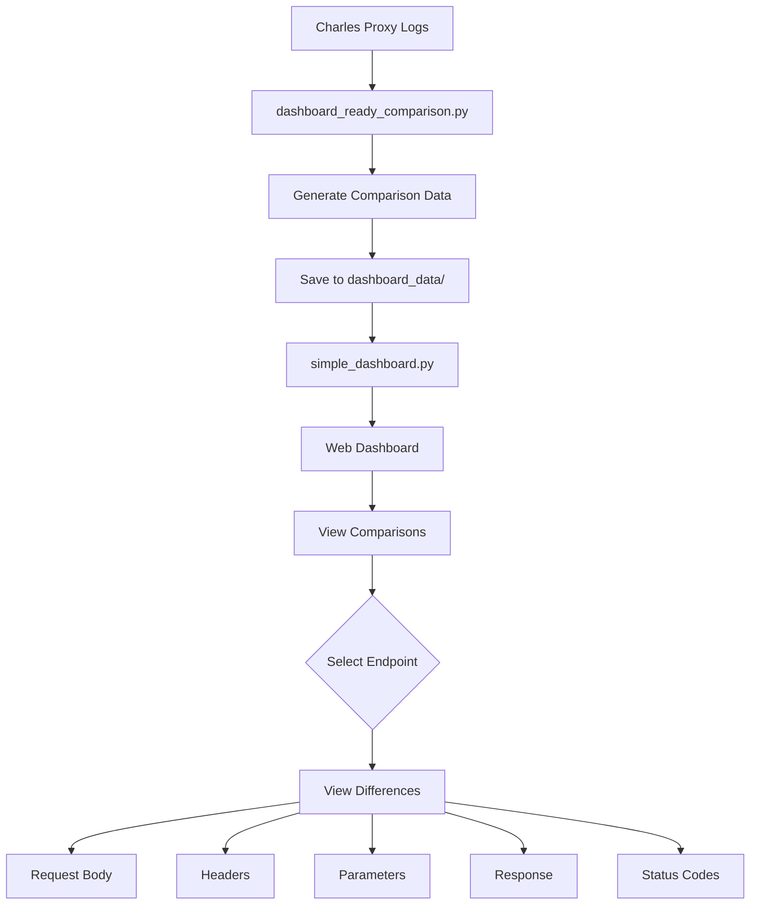
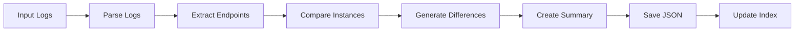
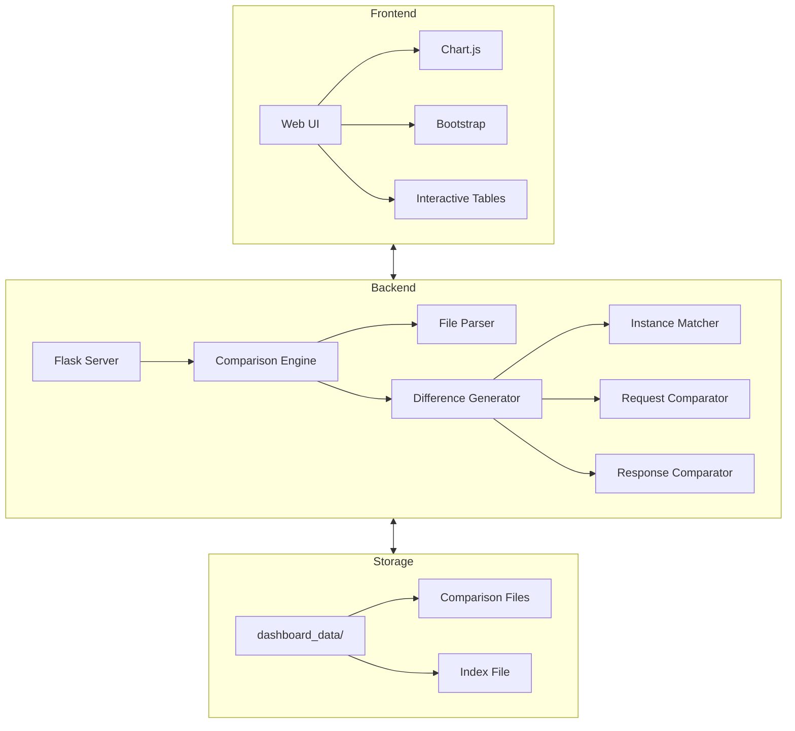

# Flow Diagrams

## Overall Workflow

## Data Processing Flow

## Component Architecture

## Diagram Descriptions

### Overall Workflow
This diagram shows the complete flow of data through the system, from the initial Charles Proxy logs to the final difference visualization. It illustrates how users interact with the system and what types of differences they can view.

### Data Processing Flow
This diagram details the internal processing steps that occur when comparing log files. It shows how raw log data is transformed into structured comparison data that can be displayed in the dashboard.

### Component Architecture
This diagram shows the system's architecture divided into three main sections:
- Frontend: The user interface components
- Backend: The server and processing components
- Storage: The data storage components

Each section contains its specific components and shows how they interact with each other. 