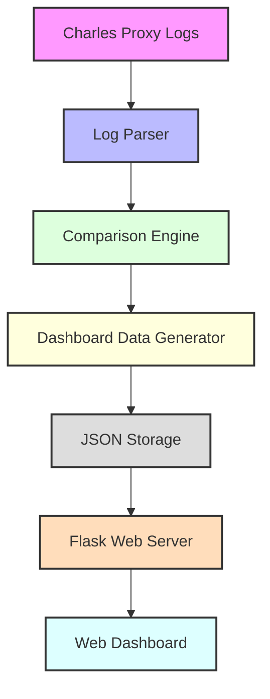

# API Comparison Dashboard

A powerful tool for comparing API responses across different versions or environments. This dashboard helps visualize and analyze differences in API endpoints, making it easier to spot changes, regressions, or improvements.

## Features

- 📊 Visual comparison of API endpoints
- 🔍 Detailed difference analysis for:
  - Status codes
  - Request parameters
  - Response bodies
  - Headers
  - Query parameters
- 📈 Summary statistics and charts
- 🎯 Filter endpoints by change type (Added, Removed, Modified)
- 💡 Intuitive UI with clear difference highlighting
- 📱 Responsive design for all devices

## System Architecture



## Installation

1. Clone the repository:
```bash
git clone <repository-url>
cd api-comparison-dashboard
```

2. Install dependencies:
```bash
pip install -r requirements.txt
```

## Usage

### 1. Generate Comparison Data

Use the `dashboard_ready_comparison.py` script to generate comparison data:

```bash
python dashboard_ready_comparison.py \
  --file_paths '["path/to/first.json", "path/to/second.json"]' \
  --output_dir "./dashboard_data" \
  --comparison_level "comprehensive"
```

Parameters:
- `file_paths`: JSON array of paths to Charles log files to compare
- `output_dir`: Directory to save the comparison results (default: "./dashboard_data")
- `comparison_level`: Level of detail for comparison (choices: "basic", "detailed", "comprehensive")
- `metadata`: Optional JSON string of metadata to include

### 2. Start the Dashboard

Run the Flask server:

```bash
python simple_dashboard.py --port 5000 --data-dir "./dashboard_data"
```

Parameters:
- `port`: Port to run the dashboard on (default: 5000)
- `data-dir`: Directory containing comparison data (default: "./dashboard_data")

### 3. View the Dashboard

Open your browser and navigate to:
```
http://localhost:5000
```

## Data Flow

1. **Log Collection**
   - Charles Proxy captures API traffic
   - Logs are exported as JSON files

2. **Comparison Generation**
   - `dashboard_ready_comparison.py` processes the log files
   - Generates structured comparison data
   - Saves results in the dashboard data directory

3. **Dashboard Presentation**
   - Flask server loads comparison data
   - Web interface displays differences
   - Interactive filtering and detailed views

## File Structure

```
.
├── dashboard_ready_comparison.py   # Comparison generator
├── server.py                      # API comparison engine
├── simple_dashboard.py            # Flask web server
├── templates/                     # HTML templates
│   ├── base.html                 # Base template with styling
│   ├── comparison.html           # Comparison view template
│   ├── index.html               # Dashboard index
│   └── error.html               # Error page
├── dashboard_data/               # Comparison results
│   ├── index.json               # Index of comparisons
│   └── *.json                   # Individual comparison files
└── README.md                     # This file
```

## Contributing

1. Fork the repository
2. Create a feature branch
3. Commit your changes
4. Push to the branch
5. Create a Pull Request

## License

This project is licensed under the MIT License - see the LICENSE file for details.

## Acknowledgments

- Built using Flask and Bootstrap
- Uses Chart.js for visualizations
- Inspired by the need for better API comparison tools

## Flow Diagrams

For detailed flow diagrams of the system architecture and processes, please see [FLOW_DIAGRAM.md](FLOW_DIAGRAM.md). 